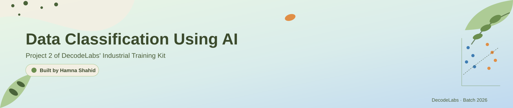

# 🌸 Data Classification Using AI

**A Python-Based Supervised Learning Project Built with Scikit-Learn, the Iris Benchmark & the K-Nearest Neighbors Algorithm**



`Python` `Scikit-Learn` `Supervised Learning` `Beginner Project` `DecodeLabs` `License`

## 🚀 Data Classification Using AI

**A Simple Classification Pipeline Demonstrating Fundamental Supervised Learning Concepts with Python**

The **Data Classification Using AI** project is **Project 2** of the DecodeLabs Artificial Intelligence Industrial Training Program.

This project introduces the fundamental concepts of **supervised machine learning** through data handling, feature scaling, model training, and output validation.

Unlike Project 1's rule-based chatbot, this project does not rely on explicitly programmed if-else rules. Instead, it teaches a model to **recognize patterns from historical data (the Iris flower dataset)** and use those patterns to classify brand-new, unseen samples.

The pipeline loads a dataset, splits it into training and testing sets, trains a K-Nearest Neighbors (KNN) classifier, and validates its predictions using a confusion matrix and F1 score rather than accuracy alone.

This project establishes a strong foundation for understanding how machines can be taught to make decisions from data instead of hardcoded rules.

## 📚 Table of Contents

- 🚀 [Introduction](#-data-classification-using-ai)
- 🎯 [Project Objective](#-project-objective)
- ❗ [Problem Statement](#-problem-statement)
- ✅ [Solution](#-solution)
- 🔎 [Project Overview](#-project-overview)
- ⚙️ [How It Works](#️-how-it-works)
- 🧠 [The Algorithm: K-Nearest Neighbors](#-the-algorithm-k-nearest-neighbors)
- ✨ [Features](#-features)
- 🛠️ [Technology Stack](#️-technology-stack)
- 📂 [Repository Structure](#-repository-structure)
- ⚙️ [Installation](#️-installation)
- ▶️ [Running the Project](#️-running-the-project)
- 💬 [Example Output](#-example-output)
- 🧪 [Testing](#-testing)
- 📖 [Documentation](#-documentation)
- 🔐 [Security](#-security)
- 🚧 [Limitations](#-limitations)
- 🚀 [Future Improvements](#-future-improvements)
- 🤝 [Contributing](#-contributing)
- ❓ [Troubleshooting](#-troubleshooting)
- 👩‍💻 [Author](#-author)
- 📜 [License](#-license)

## 🎯 Project Objective

The primary objective of this project is to build a simple, working supervised learning pipeline that can classify data into categories using a small, well-understood dataset.

The project focuses on developing a practical understanding of:

- Loading and inspecting a dataset
- Feature scaling and normalization
- Train/test splitting and why shuffling matters
- Supervised learning with K-Nearest Neighbors
- Model training with `.fit()` and `.predict()`
- Choosing hyperparameters (finding the best `k`)
- Evaluating a model beyond raw accuracy
- Reading a confusion matrix and F1 score
- Basic supervised learning concepts

The project is designed to simulate a real classification workflow using the Input → Process → Output (IPO) framework taught throughout the training kit.

## ❗ Problem Statement

Beginner machine learning exercises often skip straight to calling `.fit()` on a dataset without explaining *why* each step matters.

A trustworthy classification pipeline needs to:

- Load and understand the shape and classes of its data
- Split data into training and testing sets **without leaking information**
- Scale features so no single measurement dominates distance calculations
- Choose a reasonable algorithm and tune its parameters
- Predict on unseen data
- Validate those predictions properly — accuracy alone can be misleading, especially on imbalanced data

The challenge of this project is to combine these steps into one clear, working pipeline instead of treating them as separate, disconnected exercises.

## ✅ Solution

**Data Classification Using AI** solves this problem with a complete Scikit-Learn pipeline: load → split → scale → train → tune → evaluate → predict, using the classic Iris flower dataset as the training ground.

## 🔎 Project Overview

This project is a Python-based supervised learning project developed as **Project 2** of the DecodeLabs AI Industrial Training Program.

It uses `scikit-learn`'s built-in Iris dataset, a `StandardScaler` for feature scaling, and a `KNeighborsClassifier` to classify flowers into one of three species based on their measurements.

### ✨ Key Highlights

- 🌸 Loads and inspects the Iris benchmark dataset (150 samples, 3 classes, 4 features)
- 🔀 Performs a stratified 80/20 train-test split
- 📏 Scales features with `StandardScaler`
- 🧠 Trains a K-Nearest Neighbors classifier
- 🎯 Automatically searches for the best `k` value
- 📊 Validates results with a confusion matrix, F1 score, and full classification report
- 🔮 Predicts the species of a brand-new, unseen flower

The project provides a practical foundation in supervised learning, data handling, and model evaluation.

## ⚙️ How It Works

The pipeline follows the IPO (Input → Process → Output) structure:

1. **Input** — Load the Iris dataset and inspect its shape, features, and classes.
2. **Process** — Split the data into training/testing sets, scale the features, and train a KNN model.
3. **Output** — Predict on the test set and validate results with a confusion matrix and F1 score.
4. A small hyperparameter search finds the best value of `k` before final evaluation.
5. The trained model then predicts the species of a completely new, unseen flower sample.

## 🧠 The Algorithm: K-Nearest Neighbors

The model uses the **proximity principle**: similar things exist close together in feature space.

```python
model = KNeighborsClassifier(n_neighbors=k)
model.fit(X_train_scaled, y_train)
predictions = model.predict(X_test_scaled)
```

For a new data point, KNN looks at its `k` closest neighbors in the training data and assigns the majority class among them. The project sweeps through several values of `k` to find the one that performs best, rather than guessing a single fixed value.

The model does not use hardcoded rules — it derives its decision boundary directly from the training data. ([Scikit-Learn documentation][1])

## ✨ Features

- 🌸 **Dataset Loading & Inspection** — Prints sample count, feature names, and class names.
- 🔀 **Stratified Train-Test Split** — Keeps class proportions balanced across both sets.
- 📏 **Feature Scaling** — Uses `StandardScaler` so all measurements contribute fairly.
- 🧠 **K-Nearest Neighbors Classifier** — A simple, interpretable supervised learning algorithm.
- 🎯 **Automatic K Tuning** — Sweeps `k=1` through `k=15` to find the best-performing value.
- 📊 **Honest Evaluation** — Reports accuracy, F1 score, a confusion matrix, and a full classification report instead of relying on accuracy alone.
- 🔮 **Live Prediction** — Classifies a brand-new, unseen flower measurement.
- 🐍 **Minimal Dependencies** — Only `numpy` and `scikit-learn` are required.

## 🛠️ Technology Stack

| Technology | Purpose |
|---|---|
| 🐍 Python 3.8+ | Main programming language |
| 📦 scikit-learn | Dataset, model, scaling, and evaluation tools |
| 🔢 NumPy | Numerical array handling |
| 📏 StandardScaler | Feature normalization |
| 🧠 KNeighborsClassifier | Supervised classification algorithm |
| 💻 Terminal / Command Prompt | Runs the pipeline |

### Dependencies

This project requires two third-party packages: `numpy` and `scikit-learn`. No API keys, databases, or external services are needed.

## 📂 Repository Structure

```
data-classification-ai/
│
├── .gitattributes
├── CONTRIBUTING.md
├── data_classification.py
├── LICENSE
├── project2_banner.svg
├── README.md
└── requirements.txt
```

### File Descriptions

| File | Description |
|---|---|
| `data_classification.py` | Main Python classification pipeline |
| `README.md` | Main project documentation |
| `CONTRIBUTING.md` | Guidelines for contributing to the project |
| `requirements.txt` | Project dependency list |
| `.gitattributes` | Git line-ending and file-handling rules |
| `LICENSE` | Project license |
| `project2_banner.svg` | Project banner used in the README |

## ⚙️ Installation

### Prerequisites

Before running the project, make sure you have:

- Python 3.8 or higher
- Git
- A code editor such as Visual Studio Code
- A terminal or command prompt

**1. Clone the Repository**

```bash
git clone https://github.com/hamnashahiddev/data-classification-ai.git
```

**2. Navigate to the Project**

```bash
cd data-classification-ai
```

**3. Verify Python**

```bash
python --version
```

On Windows, you can also use:

```bash
py --version
```

**4. Create a Virtual Environment (recommended)**

```bash
python3 -m venv venv
source venv/bin/activate      # Windows: venv\Scripts\activate
```

**5. Install Dependencies**

```bash
pip install -r requirements.txt
```

## ▶️ Running the Project

After completing the installation, run the pipeline from the project directory.

### Run with Python

```bash
python data_classification.py
```

On Windows, you can also use:

```bash
py data_classification.py
```

The script will run the full pipeline end-to-end: load data, tune `k`, train, evaluate, and predict — no arguments needed.

## 💬 Example Output

```
=======================================================
 RAW MATERIAL: The Iris Benchmark
=======================================================
Samples:    150 (balanced)
Features:   4 -> ['sepal length (cm)', 'sepal width (cm)', 'petal length (cm)', 'petal width (cm)']
Classes:    3 -> ['setosa', 'versicolor', 'virginica']

=======================================================
 TUNING THE ENGINE: Choosing K
=======================================================
  k= 1  ->  accuracy=96.67%
  k= 7  ->  accuracy=96.67%
  ...
Best K found: 1 (accuracy=96.67%)

=======================================================
 OUTPUT VALIDATION
=======================================================
Accuracy: 96.67%
F1 Score (macro): 0.967   <- the trustworthy metric

Confusion Matrix (rows = actual, cols = predicted):
[[10  0  0]
 [ 0 10  0]
 [ 0  1  9]]

=======================================================
 LIVE PREDICTION: A new, unseen sample
=======================================================
Input measurements: [5.1, 3.5, 1.4, 0.2]
Predicted species: setosa
```

## 🧪 Testing

The pipeline should be tested to confirm each stage works correctly.

### Data Loading Test

Confirm the dataset loads with:
- 150 total samples
- 4 features
- 3 target classes

**Expected Result:** The summary printed at the start should match these numbers exactly.

### Train-Test Split Test

Confirm the split preserves class balance (stratified).

**Expected Result:** Each class should appear roughly proportionally in both the training and test sets.

### Model Training Test

Confirm the model trains without errors for a range of `k` values (1–15).

**Expected Result:** Accuracy should print for every `k` in the sweep with no exceptions raised.

### Evaluation Test

Confirm the confusion matrix and F1 score are generated after training.

**Expected Result:** Accuracy should be above 90% on the Iris dataset, and the confusion matrix should sum to the total number of test samples (30).

### New Prediction Test

Test the model on a new flower measurement, e.g. `[5.1, 3.5, 1.4, 0.2]`.

**Expected Result:** The model should predict `setosa` for this input, since it closely matches known setosa measurements.

## 📖 Documentation

| File | Description |
|---|---|
| `README.md` | Complete project overview, setup, usage, and documentation |
| `CONTRIBUTING.md` | Contribution guidelines and local setup instructions |
| `requirements.txt` | Project dependency information |
| `LICENSE` | Project licensing information |

## 🔐 Security

This project is designed to run locally and does not require any external services or sensitive credentials.

### No API Keys Required

The pipeline does not require:

- API keys
- Passwords
- Authentication tokens
- Database credentials
- Cloud credentials

### Local Execution

All data loading, training, and prediction happen locally through the Python script. The Iris dataset ships directly with `scikit-learn` — no external downloads or network calls are made.

### Best Practice

Although this project does not require secrets, never commit sensitive information such as `.env` files, API keys, passwords, or access tokens to a public GitHub repository.

## 🚧 Limitations

The current version of the pipeline is intentionally simple and beginner-focused.

- **Small, Clean Dataset** — The Iris dataset is small, balanced, and free of missing values; real-world data is rarely this tidy.
- **Single Algorithm** — Only K-Nearest Neighbors is implemented; no comparison against other classifiers (e.g. logistic regression, decision trees, SVM).
- **No Cross-Validation** — Uses a single train-test split rather than k-fold cross-validation.
- **No Persistence** — The trained model is not saved to disk; it must be retrained on every run.
- **No Web or GUI Interface** — Runs only from the command line.
- **Fixed Feature Set** — Cannot classify data with a different number or type of features without code changes.

## 🚀 Future Improvements

The current pipeline provides a foundation that can be expanded into a more advanced classification system.

- 🔁 Add k-fold cross-validation for more reliable evaluation
- 🧮 Compare multiple algorithms (Logistic Regression, Decision Trees, SVM, Random Forest)
- 💾 Save and load trained models with `joblib` or `pickle`
- 📊 Add data visualization (scatter plots, decision boundaries) with `matplotlib`
- 📁 Support loading custom datasets from CSV files
- 🖥️ Build a simple web interface for live predictions
- ⚙️ Add automated hyperparameter tuning with `GridSearchCV`
- 🧪 Add a proper `pytest` test suite
- 🌐 Deploy the model behind a small API
- 🧠 Explore more advanced supervised learning techniques

## 🤝 Contributing

Contributions and suggestions are welcome. See [`CONTRIBUTING.md`](CONTRIBUTING.md) for full guidelines.

If you would like to improve this project, you can:

- Add support for additional datasets
- Improve model evaluation and reporting
- Add data visualizations
- Fix bugs
- Improve documentation
- Suggest new features

### Contribution Steps

1. Fork the repository.
2. Create a new branch:
   ```bash
   git checkout -b feature/add-cross-validation
   ```
3. Make your changes.
4. Test the pipeline:
   ```bash
   python data_classification.py
   ```
5. Commit your changes:
   ```bash
   git commit -m "Add k-fold cross-validation"
   ```
6. Push your branch:
   ```bash
   git push origin feature/add-cross-validation
   ```
7. Open a Pull Request.

Please make sure your changes are tested before submitting a Pull Request.

## ❓ Troubleshooting

If you experience problems while running the pipeline, check the following:

### Python Is Not Recognized

Check your Python installation:

```bash
python --version
```

or:

```bash
py --version
```

### ModuleNotFoundError: No module named 'sklearn'

Install the dependencies:

```bash
pip install -r requirements.txt
```

### data_classification.py Not Found

Make sure you are inside the project directory:

```bash
cd data-classification-ai
```

Then run:

```bash
python data_classification.py
```

### Low Accuracy or Unexpected Results

- Confirm the dataset loaded correctly (150 samples, 3 classes).
- Try a different range of `k` values in `find_best_k()`.
- Make sure `StandardScaler` is fit only on training data, not test data (this is already handled correctly in the script).

### SyntaxError / IndentationError

Check the line number shown in the Python error message and verify consistent indentation around that line.

## 👩‍💻 Author

**Hamna Shahid**
AI Automation Engineer

Passionate about Artificial Intelligence, AI automation, intelligent systems, workflow automation, and practical technology solutions.

### Connect With Me

- GitHub
- LinkedIn

## 📜 License

This project is licensed under the MIT License.

You are free to:

- ✅ Use the project
- ✅ Modify the source code
- ✅ Distribute the project
- ✅ Use it for learning
- ✅ Build upon the project

See the [`LICENSE`](LICENSE) file for the complete license terms.

## ⭐ Support

If you found this project useful, consider giving the repository a ⭐ on GitHub.

*Built with 🐍 Python & 📊 Scikit-Learn*

[1]: https://scikit-learn.org/stable/modules/neighbors.html "Scikit-Learn Nearest Neighbors Documentation"
